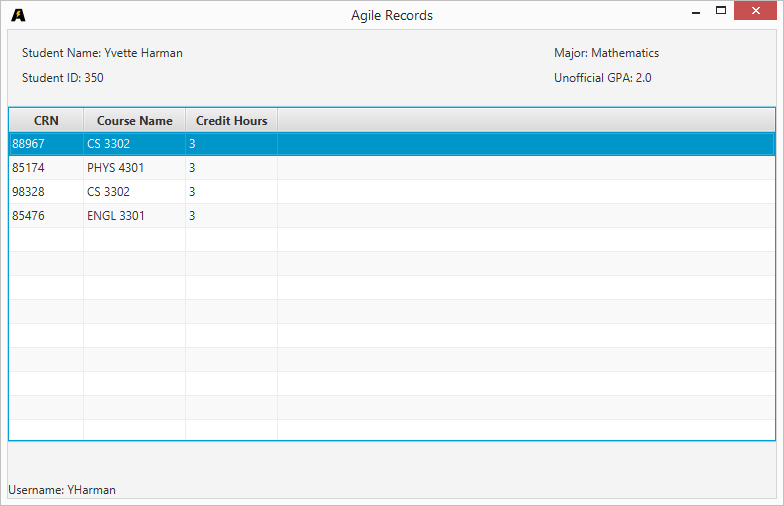

Agile Records is a GUI application used for managing multiple students and their information while also allowing
students to simply view this important information.

Admins are given the ability to view and manage students and their information,

while students can easily check their courses

and course information
