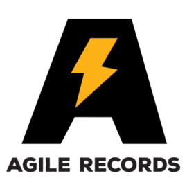
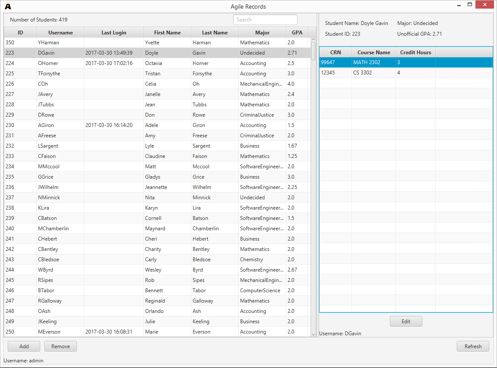

Agile Records is a school project GUI application used for managing multiple students while also allowing
students to simply view their important information.

# Admins
Admins are given the ability to view and manage students.

# Students
Students can quickly and easily view their course information and more.

  
  

